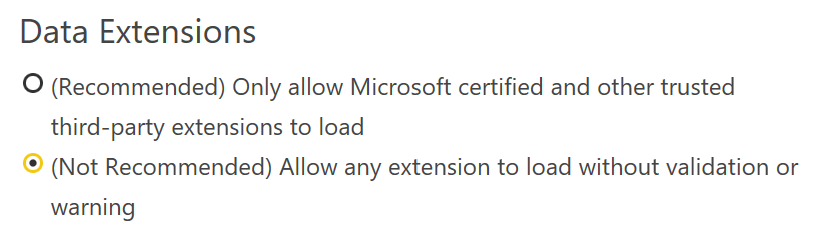
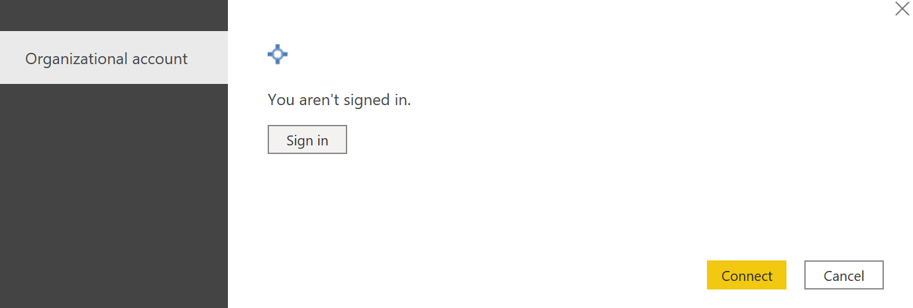
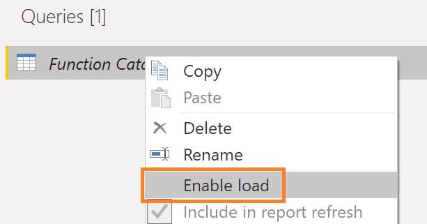

# Power Query Custom Data Connector for Power BI METADATA REST APIs (Government Community Cloud)

This connector wraps a few of the "Get" endpoints in the Power BI Metadata API, so that OAuth can be used to authenticate to the service.  
   
The endpoints for this custom connector on NOT part of the v1.0 Microsoft Power REST APIS. Microsoft lacks API support for Dataflows Gen1, Apps, and Deployment Pipleines.  As of April 2024, Microsoft does not provide APIs for:

    1) Error Details in Dataflow Refreshes
    2) Whether a Dataflow is Scheduled for a Refresh
    3) The details of the refresh schedule
    4) What are the pending requests for an App
    5) What are the deployment settings for each artifact in a deployment pipeline stage

<b>NOTE: This lack of support severely hinders the ability to monitor for issues. <u>For each endpoint listed in [Functions Implemented](#functions-implemented), I have identified the Fabric idea to vote up, so it can become part of Microsoft's supported REST APIs.</u></b>

This connector serves as a way to have a library of Power Query functions to build datasets without the need for storing client secrets or passwords in the dataset.  The custom data connector will need to be installed in the a Power BI Gateway in order to refresh datasets leveraging this custom connector.

Each function returns a JSON body and not a table of data.  This decision was made to provide flexibility in converting the JSON body to tabular data when 1) the API responses are changed by Microsoft or 2) the API responses differ between commercial and sovereign clouds (e.g., GCC, DoD, etc.). 

## Table of Contents

1. [Installation](#installation)
    1. [Desktop](#desktop)
    1. [Using Functions](#using-functions)
    1. [Functions Implemented](#functions-implemented)
    1. [On-Premises Gateway](#on-premises-gateway)
1. [Building Connector](#building-connector)
    1. [Testing Connector](#testing-connector)

## Installation

### Desktop
1. Open Power BI Desktop and navigate to File -> Options and Settings -> Options.
2. Navigate to GLOBAL -> Security and under "Data Extensions" choose "Allow any extension..."

Because this is a custom data connector you have to choose this option in order to use it in Power BI Desktop.

3. Close all Power BI Desktop instances on your local machine.  You are often prompted to do so by Power BI Desktop.
4. Copy the [.mez file](https://github.com/kerski/powerquery-connector-pbi-metadata-rest-api-gcc/releases) to your folder "Documents\Power BI Desktop\Custom Connectors".  If the folder does not exist, create it first.
5. Open Power BI Desktop.
6. Select Get Data option.
7. Navigate to the "Other" section and you should see the "Connect to Power BI REST API" connector.

8. Select the connector and press the "Connect" button.
9. You may be prompted with the pop-up below. Choose "Continue".

10. If this is your first time using the custom data connector you will be prompted to sign into Office 365. Please follow the instructions to sign in and then choose the "Connect" button.

10. The Navigator prompt will appear (example below).

11. Choose the "Get Dataflows Gallery" option and you should see a json response (see example below).

12. Then choose the "Transform Data" button.  This should open the Power Query Editor.

13. Under "Applied Steps", remove the steps "Invoked FunctionGetDataflowGallery1" and "Navigation".

14. You now will see a catalog of the Power BI REST APIs to leverage.  I suggest you rename the Query "GetDataflowGallery" to "Function Catalog".

15. I suggest you also uncheck "Enable Load" for the Function Catalog so it doesn't appear in the data model. When disabled the Function Catalog will appear italicized.

### Using Functions

With the Function Catalog created, please follow these steps to leverage the functions:

1. Identify the name of the function you wish to use. Right-click on the "Function" value located for the appropriate row and select "Add as New Query".

2. The function will be created and it can now be used to query the Power BI service.

### Functions Implemented

These functions call end points that are not a part of the supported Power BI REST APIs; however, these functions are critical to getting
important information programmatically for monitoring. 

Below are the end points implemented along with the link to vote up this end point to become part of Microsoft's main REST API offering.

### Apps
| End Point                      | Description  | Fabric Idea |
|:-----------------------------|:-------------|:------------------|
| GetAppDetails          | Returns details on an App based on the Workspace id that hosts that App.  | [REST API Cmdlet for getting all outstanding Pending Access requests](https://bit.ly/3KJnvto) |

### Dataflows
| End Point                      | Description  | Fabric Idea |
|:-----------------------------|:-------------|:------------------|
| GetDataflowGallery          | Returns a list of all dataflows and properties from the metadata API.  | [API for Get Refresh Schedule of Dataflows](https://bit.ly/3MLztFC) |
| GetDataflowTranscationDetails | Returns a list of transactions details for a specific dataflow refresh based on the Refresh ID.  | [Add Dataflow failure reason to the Transactions API](https://ideas.fabric.microsoft.com/ideas/idea/?ideaid=2fad1514-3738-ec11-b76a-281878de77da) |
| GetDataflowExtendedSettings             | Returns a list of details for a specific dataflow. |[API for Get Refresh Schedule of Dataflows](https://bit.ly/3MLztFC) |

### Pipelines
| End Point                      | Description  | Fabric Idea |
|:-----------------------------|:-------------|:------------------|
| GetDataflowGallery          | Returns a list of all dataflows and properties from the metadata API.  | [API for Get Refresh Schedule of Dataflows](https://bit.ly/3MLztFC) |
| DiscoverArtifacts | Returns a list of data source or parameter rules associated with the artifact (ex. semantic model) applied to the next stage.  | [Add Dataflow failure reason to the Transactions API](https://ideas.fabric.microsoft.com/ideas/idea/?ideaid=c348e92e-1eda-ed11-9139-281878ded556) |

### On-Premises Gateway

The custom data connector will need to be installed in the a Power BI Gateway in order to refresh datasets leveraging this custom connector.  For more information on installing a custom data connector with a gateway please see: https://learn.microsoft.com/en-us/power-bi/connect-data/service-gateway-custom-connectors.

## Building Connector

### Prerequisites 

1. Install Visual Studio code: https://code.visualstudio.com/download.
1. Install Power Query SDK for Visual Studio Code: https://github.com/microsoft/vscode-powerquery-sdk
1. Clone this repo to your local machine.

## Compile

In order to the compile the custom data connector to the .mez file, please follow these instructions:

1. Using your keyboard, use the shortcut Ctrl+Shift+B.  Visual Studio will prompt you within the command palette to choose a build task. Select the "build: Build connector project using MakePQX".

2. If the build succeeds the .mez file will update in the folder "bin\AnyCPU\Debug".

3. If the build fails the Power Query SDK often presents a notification (see example below).

### Testing Connector

In order to test the custom data connector, please follow these instructions:

1. Choose the "Set Credential" option within the Power Query SDK. Select AAD and follow the prompts to log into Microsoft 365.

2. The .query.pq file is used to test the custom data connector, please update the section labeled "TEST VARIABLES" for your own environment.

3. When you are ready to test, use the "Evaluate current file" option in the Power Query SDK in the "Explorer" tab.

4. When the testing completes, a new tab will be present any failed results or if all the tests passed (example below).

